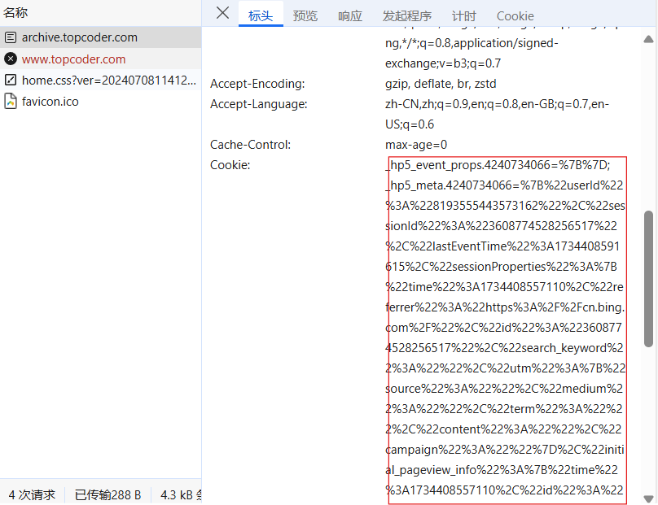

由于原来的下载数据方式已经失效，这里写了个新的下载器。现在无法生成 config.yaml 文件。

当前仓库未在 Linux 下测试。

### 依赖

#### node.js v16

- windows 去[官网](https://nodejs.org/zh-cn/)下载安装包。 

- ubuntu apt 的默认版本是 v12.22.9，按如下方式安装 v16.18.1

```bash
cd ~
curl -sL https://deb.nodesource.com/setup_16.x -o nodesource_setup.sh
sudo bash nodesource_setup.sh
sudo apt install nodejs
```

#### 几个库

完成上一步骤后再进行以下命令，如果 windows 下[无法运行 npm 怎么办](https://blog.csdn.net/oYinHeZhiGuang/article/details/124713422)。

```bash
npm install jsdom
npm install adm-zip
```

### 使用

#### 设置 Cookie

可以不设置 Cookie，如需设置访问 [Topcoder Archives](https://archive.topcoder.com/)，把 TopCoder 的 Cookie 放进 Cookie.txt 里，失效的时候再更新。注意访问的是 [Topcoder Archives](https://archive.topcoder.com/)，不是主站。

关于如何复制 Cookie 字符串，Chrome 浏览如图所示，F12 打开开发者工具，点到网络，ctrl + R，点击第一条请求，在请求标头中找到 cookie，再右键，复制值。



#### 下载题目数据

比如需要的题号为 14588，直接运行：

```bash
node main.js 14588
```

大概要运行 3~10s，如果时间太长了应该是遇到故障了。

之后生成一个目录 14588，目录包含如下内容：

- 目录 data，包含二进制格式的测试数据
  - 1.in, 1.out
  - 2.in, 2.out
  - ...
- 文件 data.txt，测试数据的文本形式
- 文件 grader.cpp，评测用文件
- 文件 compile.sh，OJ 用文件。
- ~~文件 config.yaml，OJ 用文件。~~

另外，有几个可选参数：

- `-j` 或 `-judge`，额外生成一个 `judge.sh` 和 `judge.cpp`，在 Linux 下对同目录下的 C++ 程序 `foo.cc` 进行简单测试（只测试正确性，不限制时间空间）。在 Windows 下运行 `judge.cpp` 同样可以测试代码。

### 注意事项

- 源程序应采用和 TopCoder 一样的实现方式，不能使用 `stdin` 和 `stdout`，并且参数和返回值类型应当严格按照要求，比如要求返回值为 `int` 不能返回 `long long`。

- 由于 grader.cpp 用了 C++11，所以评测时至少开 C++11。
